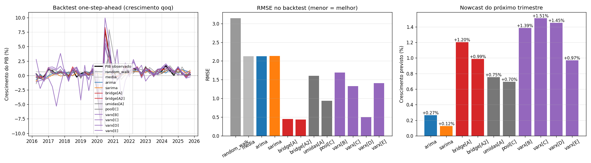

# GDP-Prediction — Nowcasting do PIB Brasileiro

O PIB brasileiro é divulgado pelo IBGE com cerca de dois meses de atraso em relação ao
fim do trimestre. Este projeto estima o crescimento econômico **em tempo real**
(*nowcasting*) usando indicadores mensais antecedentes — abordagem usada por bancos
centrais e instituições financeiras — antes da divulgação oficial.

Implementa **ARIMA**, **SARIMA**, **VAR**, **VARX** (VAR condicional) e uma **bridge
equation** com *backtesting* rolling e avaliação explícita de **look-ahead bias**
(respeitando o calendário real de publicação de cada série). Dados públicos do **BCB
(SGS)** e **IBGE**.

### Modelos

| Modelo | Tipo | Como usa os indicadores |
|--------|------|--------------------------|
| ARIMA / SARIMA | univariado | só o passado do PIB (+ dummies de COVID) |
| VAR | multivariado | sistema conjunto; **prevê** os indicadores |
| VARX | multivariado | VAR conjunto, mas **condiciona** o PIB nos indicadores contemporâneos já publicados |
| bridge | regressão | regride o PIB nos indicadores contemporâneos já publicados |
| umidas | regressão | U-MIDAS: meses 1-3 do IBC-Br dentro do trimestre como regressores irrestritos (Foroni-Marcellino-Schumacher, 2015) |
| pool | combinação | média com pesos iguais de 3 bridges — bridge IBC-Br, U-MIDAS e bridge setorial (PIM+PMS+PMC); literatura de forecast combination |

As variantes **umidas[A]** e **pool[C]** entram no backtest com a meta de **bater a
baseline bridge[A]**.

ARIMA/SARIMA apenas extrapolam o passado do PIB. O VAR prevê os próprios indicadores —
desperdiçando a vantagem do nowcasting. **VARX** e **bridge** exploram a real vantagem: os
indicadores mensais do trimestre corrente (IBC-Br, PIM, PMS, PMC) que **já foram
publicados** quando o PIB ainda não saiu.

### Baseline: IBC-Br (prévia oficial do PIB)

O **IBC-Br** é o índice de atividade econômica do Banco Central — a *prévia oficial* do
PIB. Por isso a **bridge sobre o IBC-Br (conjunto A)** é adotada como **baseline do
projeto**: é o número que qualquer modelo mais elaborado precisa superar para se justificar.

### Conjuntos de variáveis (A/B/C/D/E)

Os modelos multivariados são testados com diferentes conjuntos de indicadores (os de
atividade e o Ibovespa entram como **variação % T/T dessazonalizada**, mesma escala do
alvo; os índices de confiança entram em nível):

| Conjunto | Variáveis | Uso |
|----------|-----------|-----|
| **A** | IBC-Br (dessaz BCB) | baseline (bridge) |
| **A2** | IBC-Br dessaz BCB **+ dessaz própria (STL)** | bridge — **bate o baseline** |
| **B** | PIM + PMS + PMC (indústria, serviços, comércio) | VARX |
| **C** | IBC-Br + PIM + PMS + PMC | VARX |
| **D** | IBC-Br + IPCA + câmbio (bloco macro) | VARX |
| **E** | endóg.: IBC-Br + spread de crédito · exóg.: fator PCA(PIM,PMS,PMC) + confiança consumidor | VARX (+ dummy COVID) |

Variantes mantidas (a pedido): **baseline bridge[A]**, **ARIMA/SARIMA** (nos gráficos) e
**apenas os VARX** entre os multivariados — o VAR puro e bridge[B/C] foram removidos.

O **conjunto E** é um VARX redesenhado com **3 endógenas** (`pib_growth`, `ibcbr`,
`spread` de crédito) e **exógenas**: um **fator PCA** que resume os indicadores de
atividade (PIM, PMS, PMC) num único componente, a **confiança do consumidor** e a
**dummy de pico da COVID (2020Q1-Q2)** (regressor exógeno verdadeiro, não condicionado).
O PIB é condicionado nos valores contemporâneos de IBC-Br e spread, já publicados antes
do PIB.

### Bridge[A2]: dupla dessazonalização (supera o IBC-Br)

A maior fonte de divergência entre IBC-Br e PIB é a **dessazonalização** (modelos/amostras
distintos; BCB Estudo Especial 3/2018). O conjunto **A2** explora isso: além do IBC-Br
dessaz do BCB, calcula uma **dessazonalização própria via STL** sobre o IBC-Br bruto (SGS
24363) e usa **as duas** numa bridge. A divergência entre os dois métodos de ajuste carrega
sinal sobre a sazonalidade do PIB. No backtest realista (mesma janela, 71 trimestres):
bridge[A] RMSE 0.562 → **bridge[A2] 0.524** (−6.8%; pré-2020 0.603 → 0.541).

O backtest agora reporta, além do RMSE total: **RMSE pré-2020** e **RMSE pós-2020**
separados, e pode usar **janela rolante de estimação** (`--train-window N`, em trimestres;
ex.: `20` ≈ 5 anos) em vez da amostra completa.

## Resultados (`--model all --backtest`, alvo QoQ)

Backtest *rolling* realista (janela expansível, *one-step-ahead*) na janela comum de
avaliação (39 trimestres, ~2016–2025; `n` reflete a janela de cada variante):

| modelo | RMSE | RMSE pré-2020 | RMSE pós-2020 | RMSE ex-COVID | MAE | viés |
|--------|-----:|-----:|-----:|-----:|-----:|-----:|
| **bridge[A2]** (dupla dessaz) | **0.435** | **0.335** | 0.488 | **0.418** | **0.361** | 0.037 |
| bridge[A] (IBC-Br oficial) | 0.448 | 0.405 | 0.474 | 0.435 | 0.390 | 0.035 |
| varx[D] (IBC-Br+IPCA+câmbio) | 0.503 | 0.355 | 0.576 | 0.414 | 0.378 | 0.003 |
| pool[C] (combinação) | 0.935 | 0.433 | 1.141 | 0.554 | 0.590 | −0.122 |
| varx[C] | 1.331 | 1.584 | 1.145 | 1.132 | 0.872 | 0.158 |
| varx[E] | 1.410 | 2.004 | 0.944 | 1.345 | 0.877 | −0.466 |
| umidas[A] | 1.607 | 0.550 | 2.002 | 0.571 | 0.744 | 0.035 |
| varx[B] | 1.694 | 1.241 | 1.924 | 1.604 | 1.128 | 0.180 |
| média (baseline) | 2.123 | 0.534 | 2.673 | 0.572 | 1.022 | 0.104 |
| ARIMA | 2.129 | 0.619 | 2.669 | 0.646 | 1.053 | 0.036 |
| SARIMA | 2.133 | 0.706 | 2.661 | 0.670 | 1.108 | −0.175 |
| random walk | 3.143 | 0.817 | 3.954 | 0.959 | 1.486 | −0.040 |

Na janela longa (71 trimestres, sem as séries que só começam em 2011): bridge[A] 0.562 →
**bridge[A2] 0.524** (−6.8%). Nowcast 2026Q1: bridge[A2] **+0,99%**, bridge[A] +1,20%.



### Conclusões do estudo

1. **O IBC-Br é um benchmark altíssimo.** É a prévia oficial do PIB (agregação ponderada
   pelo SCN das mesmas proxies setoriais), então qualquer modelo que apenas recombina
   PIM/PMS/PMC, confiança, spread etc. tende a **reproduzi-lo com ruído** e perder. Foi o
   que ocorreu com VAR, VARX, ARIMA/SARIMA, U-MIDAS e o *pool* de bridges.
2. **O que bateu o IBC-Br foi atacar a divergência metodológica, não prever melhor.** A
   maior fonte de erro entre IBC-Br e PIB é a **dessazonalização** distinta (BCB Estudo
   Especial 3/2018). O `bridge[A2]` usa **duas** dessazonalizações do IBC-Br (a oficial do
   BCB + uma própria via STL sobre a série bruta) — a *diferença* entre os métodos carrega
   sinal sobre a sazonalidade do PIB. Resultado: **melhor modelo em todas as janelas**, com
   o ganho concentrado no pré-2020 (0.405 → 0.335, −17%).
3. **Combinação de previsões e U-MIDAS não ajudaram aqui.** Em pesos iguais, somar um
   modelo ótimo (bridge IBC-Br) a modelos piores **piora** — o U-MIDAS (decomposição mensal
   do IBC-Br) é especialmente ruim no pós-2020 volátil.
4. **Correção agro ficou de fora.** As séries de PIB-agro trimestral saem junto com o PIB
   (circular/look-ahead) e o LSPA é previsão de safra anual sem mapeamento limpo para QoQ —
   alto risco de overfit em ~70 observações.
5. **Ressalva.** A STL é estimada sobre toda a amostra (como a própria série dessaz do BCB,
   que é revisada) — há leve *look-ahead* na sazonalidade, consistente com o resto do
   pipeline. Reestimar a STL por janela é um refinamento futuro; o ganho deve persistir.


## Indicadores

| Série | Fonte | Código | Defasagem | Transformação |
|-------|-------|--------|-----------|---------------|
| PIB (índice dessaz. trimestral) — *alvo* | BCB SGS | 22109 | ~60 d | var % T/T |
| IBC-Br dessazonalizado | BCB SGS | 24364 | ~45 d | var % T/T |
| PIM-PF indústria geral (dessaz) | BCB SGS | 21859 | ~35 d | var % T/T |
| PMS volume serviços (dessaz) | IBGE SIDRA | 8688 / 7168 | ~45 d | var % T/T |
| PMC volume varejo (dessaz) | IBGE SIDRA | 8880 / 7170 | ~45 d | var % T/T |
| IPCA (variação mensal) | BCB SGS | 433 | ~10 d | soma trimestral |
| Câmbio R$/US$ (venda, média) | BCB SGS | 3698 | ~1 d | var % T/T |
| Spread médio de crédito — Total | BCB SGS | 20783 | ~30 d | nível (p.p.) |
| Confiança do Consumidor | BCB SGS | 4393 | ~5 d | média trimestral (nível) |

> O fator de atividade do conjunto E é o 1º componente principal (PCA) de PIM, PMS e PMC,
> padronizados. O cliente de dados também suporta a fonte `yahoo` (ex.: `^BVSP`), caso
> queira reintroduzir índices de mercado. Confirme nomes/valores no teste local com
> `python scripts/fetch_data.py --refresh`.

As defasagens de publicação (`config.py`) são o núcleo da avaliação de *look-ahead bias*:
permitem simular exatamente quais dados estariam disponíveis numa dada data de referência.

## Instalação

```bash
pip install -r requirements.txt
```

## Uso

```bash
# 1. Coleta e cacheia as séries em data/ (use --refresh para forçar nova busca)
python scripts/fetch_data.py

# 2. Gera o nowcast e roda o backtesting
python scripts/run_nowcast.py --model all --backtest
#   --model {arima,sarima,var,varx,bridge,all}  escolhe o(s) modelo(s)
#   --set {A,B,C,D,E}                conjunto de variáveis (modelos multivariados)
#   --target {qoq,yoy}               crescimento T/T-1 ou T/T-4
#   --backtest                       roda backtest realista vs look-ahead
#   --train-window N                 janela rolante de estimação (N trimestres; ~20 = 5 anos)
#   --plot                           gera gráfico comparativo (implica --backtest)
#   --plot-file CAMINHO              PNG de saída (padrão: backtest_comparison.png)
#   --refresh                        recoleta os dados

# Baseline (bridge com IBC-Br):
python scripts/run_nowcast.py --model bridge --set A --backtest

# Novo VARX de trabalho+expectativas (sem IBC-Br, com dummy COVID):
python scripts/run_nowcast.py --model varx --set E --backtest

# Janela rolante de 5 anos (20 trimestres) vs amostra completa:
python scripts/run_nowcast.py --model varx --set E --backtest --train-window 20

# Com gráfico comparando todas as variantes:
python scripts/run_nowcast.py --model all --plot
```

> Com `--model all`, o backtest re-treina ARIMA/SARIMA com busca de ordem em cada janela
> — leva vários minutos. Para iterar rápido, rode um modelo/conjunto por vez
> (ex.: `--model varx --set E`).

O `--plot` salva um PNG com três painéis: (1) previsões *one-step-ahead* de cada
modelo vs. PIB observado no período de backtest; (2) RMSE por modelo (regime
realista); (3) nowcast do próximo trimestre por modelo.

Saída típica do backtest: uma tabela comparando, por modelo, o erro no regime
**realista** (janela expansível, *one-step-ahead*) com o regime **look-ahead** (ajuste
sobre a amostra inteira). A diferença quantifica o viés de antecipação — o regime
look-ahead apresenta erros sistematicamente menores justamente porque vaza informação
do futuro.

## Estrutura

```
config.py                      # códigos das séries, defasagens, parâmetros
src/gdp_nowcast/
├── data_sources.py            # clientes BCB SGS + IBGE (com cache CSV)
├── dataset.py                 # alinhamento mensal→trimestral, alvo, anti look-ahead
├── preprocessing.py           # ADF, diferenciação reversível
├── models/{arima,sarima,var,varx,bridge}.py
├── backtest.py                # rolling-origin, métricas, look-ahead
└── nowcast.py                 # pipeline ponta-a-ponta
scripts/{fetch_data,run_nowcast}.py
tests/                         # pytest
```

## Testes

```bash
python -m pytest
```

Cobrem o alinhamento trimestral, a reversibilidade das transformações, a guarda
anti look-ahead (asserção de que dados posteriores à data de referência não vazam) e o
ajuste/forecast dos modelos (incluindo o condicionamento do VARX).

## Avisos

- Os dados em `data/*.csv` não são versionados (ver `.gitignore`); rode `fetch_data.py`
  para populá-los.
- O nowcast usa séries já dessazonalizadas/revisadas do SGS; uma extensão natural seria
  incorporar *vintages* reais (dados como publicados na época) para um teste de
  look-ahead ainda mais fiel.
